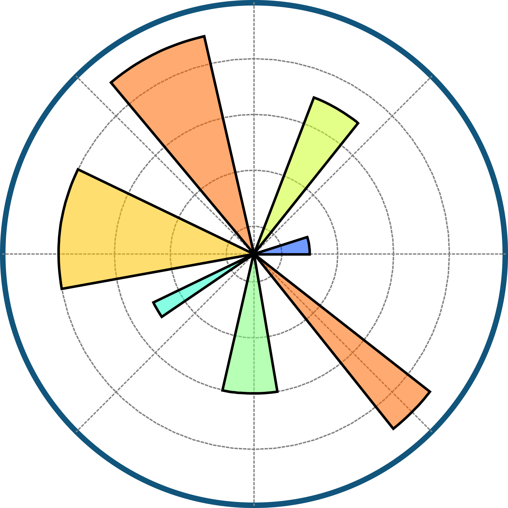
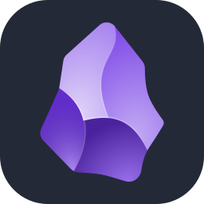
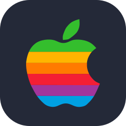

<h1 align="center">Chào 👋, mình là Kim Thịnh (KimThinh212)</h1>
<h3 align="center">Sinh viên Khoa học Dữ liệu | AI & Machine Learning Enthusiast từ Việt Nam 🇻🇳</h3>

  
  

  

---

### 👨‍💻 Giới thiệu về mình
- 🎓 Hiện là sinh viên chuyên ngành **Khoa học Dữ liệu** tại Trường Đại học Công Thương TP.HCM (**HUIT**).
- 🧠 Đang thực hiện đồ án tốt nghiệp về **Nhận diện khuôn mặt** (So sánh FaceNet & FaceNet512).
- 🚀 Đam mê xây dựng các sản phẩm AI thực tế và phân tích dữ liệu kinh doanh.
- ️⚽ Đam mê bóng đá.

---

### 🔬 Dự án tiêu biểu
- **Face Recognition Thesis:** Đánh giá kiến trúc FaceNet và FaceNet512 trên bộ dữ liệu LFW sử dụng DeepFace framework.
- **Vietnamese NLP:** Phân loại cảm xúc văn bản tiếng Việt sử dụng mô hình **PhoBERT**.
- **ML from Scratch:** Triển khai Logistic Regression và các thuật toán cơ bản chỉ với NumPy.
- **Financial Forecast:** Lập mô hình tài chính và dự báo kinh doanh cho dự án khởi nghiệp 1 tỷ VNĐ.
- **Deep Learning:** Xây dựng quy trình học sâu toàn diện giúp phân đoạn và phân loại 30 loại khối u não từ ảnh chụp MRI

---

### 💻 Tech Stack

#### 🚀 Ngôn ngữ lập trình

<table>
  <tr>
    <td align="center" width="90">
      
       Python
    </td>
    <td align="center" width="90">
      
       R
    </td>
    <td align="center" width="90">
      
       SQL
    </td>
    <td align="center" width="90">
      
       C
    </td>
    <td align="center" width="90">
      
       C++
    </td>
    <td align="center" width="90">
      
       C#
    </td>
    <td align="center" width="90">
      
       Java
    </td>
    <td align="center" width="90">
      
       JavaScript
    </td>
  </tr>
  <tr>
    <td align="center" width="90">
      
       PHP
    </td>
    <td align="center" width="90">
      
       Ruby
    </td>
    <td align="center" width="90">
      
       HTML
    </td>
  </tr>
</table>

#### 📊 AI & Khoa học Dữ liệu

<table>
  <tr>
    <td align="center" width="90">
      
       PyTorch
    </td>
    <td align="center" width="90">
      
       TensorFlow
    </td>
    <td align="center" width="90">
      
       Hugging Face
    </td>
    <td align="center" width="90">
      
       Scikit
    </td>
    <td align="center" width="90">
      
       Pandas
    </td>
    <td align="center" width="90">
      
       NumPy
    </td>
    <td align="center" width="90">
      
       Matplotlib
    </td>
    <td align="center" width="90">
      
       Seaborn
    </td>
  </tr>
  <tr>
    <td align="center" width="90">
      
       Plotly
    </td>
    <td align="center" width="90">
      
       MLflow
    </td>
    <td align="center" width="90">
      
       OpenCV
    </td>
    <td align="center" width="90">
      
       Jupyter
    </td>
  </tr>
</table>

#### 🗄️ Cơ sở dữ liệu & DevOps / Cloud

<table>
  <tr>
    <td align="center" width="90">
      
       MySQL
    </td>
    <td align="center" width="90">
      
       PostgreSQL
    </td>
    <td align="center" width="90">
      
       SQLite
    </td>
    <td align="center" width="90">
      
       MongoDB
    </td>
    <td align="center" width="90">
      
       Kafka
    </td>
    <td align="center" width="90">
      
       Docker
    </td>
    <td align="center" width="90">
      
       Git
    </td>
    <td align="center" width="90">
      
       GitHub
    </td>
  </tr>
  <tr>
    <td align="center" width="90">
      
       Azure
    </td>
  </tr>
</table>

#### 🛠️ Công cụ & Hệ điều hành

<table>
  <tr>
    <td align="center" width="90">
      
       VS Code
    </td>
    <td align="center" width="90">
      
       Anaconda
    </td>
    <td align="center" width="90">
      
       Markdown
    </td>
    <td align="center" width="90">
      
       Excel
    </td>
    <td align="center" width="90">
      
       Power BI
    </td>
    <td align="center" width="90">
      
       Tableau
    </td>
    <td align="center" width="90">
      
       Photoshop
    </td>
    <td align="center" width="90">
      
       Obsidian
    </td>
  </tr>
  <tr>
    <td align="center" width="90">
      
       Discord
    </td>
    <td align="center" width="90">
      
       Unity
    </td>
    <td align="center" width="90">
      
       Linux
    </td>
    <td align="center" width="90">
      
       Ubuntu
    </td>
    <td align="center" width="90">
      
       Apple
    </td>
  </tr>
</table>

---

### 📊 Thống kê GitHub

  
  

  

---

### 📫 Kết nối với mình:

  
  
  
  
  
  
  

---

## 🐍 Contribution Snake

  

